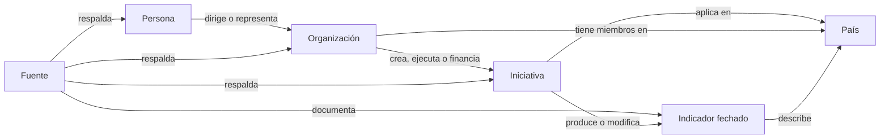

# Atlas abierto de la integración hispanoamericana

## Propósito

Construir una base pública, verificable y conectada sobre quién impulsa la integración, qué se está haciendo, dónde ocurre y cómo se relacionan sus partes. El Atlas permitirá investigar, descubrir vacíos, comparar países y convertir conocimiento disperso en proyectos útiles.

No comienza como una gran plataforma. Comienza como un registro pequeño y bien documentado que pueda crecer sin perder la procedencia de cada afirmación.

## Qué registramos

### Tres tipos principales

1. **Organizaciones:** organismos regionales, instituciones públicas, parlamentos, tribunales, bancos, redes ciudadanas, universidades, centros de investigación y otras entidades relevantes.
2. **Iniciativas:** tratados, decisiones, programas, proyectos, plataformas, conjuntos de datos, campañas y propuestas con una finalidad identificable.
3. **Personas:** titulares de cargos públicos, especialistas, investigadores y responsables que tengan una relación pública y documentada con una organización o iniciativa.

### Dimensiones de referencia

- **Países y territorios:** dimensión geográfica común, usando códigos estables y límites documentados.
- **Fuentes:** documentos, normas, páginas oficiales, datos y publicaciones que respaldan cada afirmación.
- **Indicadores:** observaciones fechadas por país o región, con definición, unidad, método y fuente.

Una fuente o un país no compite con los tres tipos principales: permite comprobarlos, ubicarlos y compararlos.

La fuente no es una nota al pie decorativa: es el camino para comprobar cada nodo y cada relación.

## Las relaciones son datos

Cada enlace debe decir **qué relación existe, durante qué periodo y según qué fuente**. Ejemplos:

- una persona `dirige` una organización;
- un país `integra` una organización;
- una organización `creó`, `ejecuta` o `financia` una iniciativa;
- una iniciativa `aplica_en` uno o varios países;
- un tratado `fundamenta` una organización o iniciativa;
- una iniciativa `continúa`, `reemplaza` o `coopera_con` otra;
- una fuente `respalda` una afirmación o relación.

Las relaciones que cambian con el tiempo necesitan fecha de inicio, fecha de fin cuando corresponda y fecha de última verificación.

## Reglas de confianza

- Toda afirmación material enlaza al menos una fuente identificable.
- Se distingue entre `oficial`, `fuente primaria no oficial`, `análisis secundario` y `aporte comunitario sin verificar`.
- Se registra cuándo se consultó la fuente y qué fragmento respalda la afirmación.
- Una ausencia de datos se muestra como ausencia; no se completa con una suposición.
- Las correcciones conservan historial.
- Las personas se registran por su papel público. No se crean perfiles políticos, expedientes personales ni campos sensibles.
- Una relación controvertida se presenta con atribución y evidencia, nunca como hecho neutral sin respaldo.

## Mapas e indicadores

Cada ficha podrá tener uno o más alcances:

- sede o punto físico;
- uno o varios países;
- subregión;
- toda Hispanoamérica;
- alcance extrarregional.

Los indicadores se guardarán como series fechadas, no como un número permanente. Por ejemplo, “apoyo a la integración” necesita pregunta exacta, población estudiada, año, porcentaje, margen o metodología disponible y fuente. Esto permitirá mapas por país sin mezclar mediciones incompatibles.

La primera visualización geográfica reutilizará el mapa canónico de las dieciocho repúblicas. Una biblioteca abierta como MapLibre puede añadir capas interactivas cuando el conjunto de datos lo justifique. El mapa nunca será la única forma de acceso: cada dato también tendrá tabla y ficha accesible.

## Cómo crecerá

### Fase 1 · Registro verificable

- acordar campos, vocabulario y reglas de fuentes;
- registrar una muestra de organizaciones e iniciativas de la primera publicación;
- incorporar personas solo cuando su función sea necesaria para entender la ejecución;
- generar fichas públicas desde archivos versionados.

**Criterio de salida:** una segunda persona puede comprobar cada ficha y proponer una corrección sin conocer el sistema por dentro.

### Fase 2 · Mapa y relaciones

- añadir alcance geográfico y vigencia temporal;
- navegar por país, tema, organización e iniciativa;
- mostrar relaciones como una lista comprensible y, opcionalmente, como grafo visual;
- publicar primeras capas comparables de indicadores.

**Criterio de salida:** una persona puede responder “qué existe sobre este tema en este país y con quién se conecta” siguiendo las fuentes.

### Fase 3 · Colaboración y calidad

- formularios de aportes y correcciones;
- revisión por pares y estados de verificación;
- historial de cambios y responsables editoriales;
- exportación abierta de los datos y documentación de reutilización.

**Criterio de salida:** colaboradores externos pueden ampliar el Atlas sin degradar la trazabilidad.

### Fase 4 · IA con fuentes

- búsqueda semántica y preguntas en lenguaje natural;
- respuestas construidas solo desde registros y documentos citables;
- indicación visible de incertidumbre, conflictos y fecha de vigencia;
- evaluación pública de exactitud antes de presentarlo como asistente.

**Criterio de salida:** cada respuesta permite abrir las fichas y fuentes utilizadas; cuando no hay evidencia suficiente, el sistema lo dice.

## Primer alcance sugerido

La primera muestra debe partir de la publicación sobre la arquitectura existente:

- ALADI;
- Comunidad Andina;
- MERCOSUR;
- SIECA y el subsistema de integración económica centroamericana;
- Alianza del Pacífico;
- sus tratados constitutivos y las iniciativas concretas ya citadas;
- países, responsables institucionales y fuentes estrictamente necesarios para explicar esas relaciones.

El objetivo del piloto no es alcanzar un número grande. Es demostrar un modelo confiable con suficiente diversidad para descubrir qué campos y relaciones faltan.

## Decisiones pendientes

- licencia específica de los datos y compatibilidad de fuentes;
- quién puede verificar o cambiar estados;
- cómo resolver nombres duplicados, cambios de cargo y organizaciones sucesoras;
- criterios para archivar información histórica sin presentarla como vigente;
- cuándo pasar de archivos versionados a una base de datos sin crear mantenimiento prematuro;
- métricas para saber si el Atlas ayuda a comprender, investigar o actuar.

## Backlog

Los borradores de trabajo listos para convertirse en Issues están en [`planning/atlas-issue-drafts.md`](planning/atlas-issue-drafts.md).
