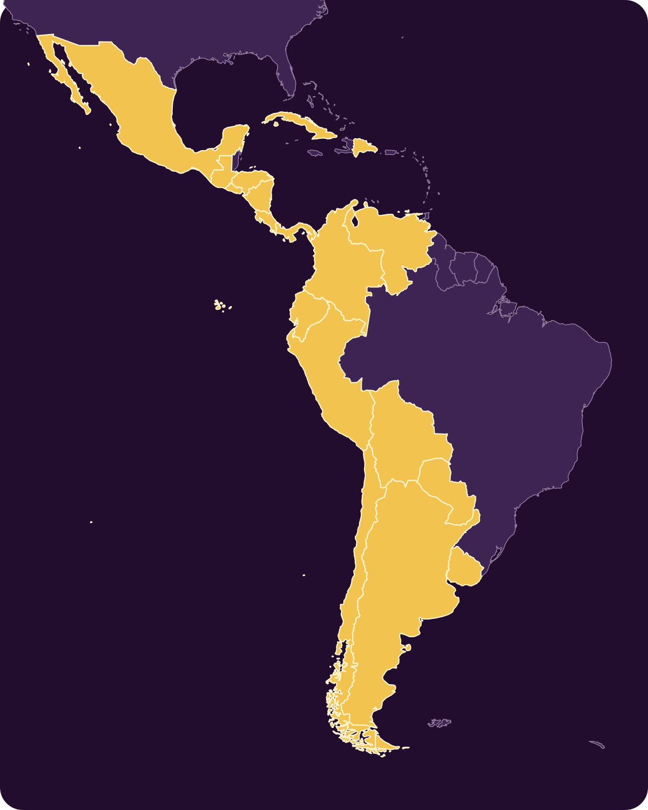
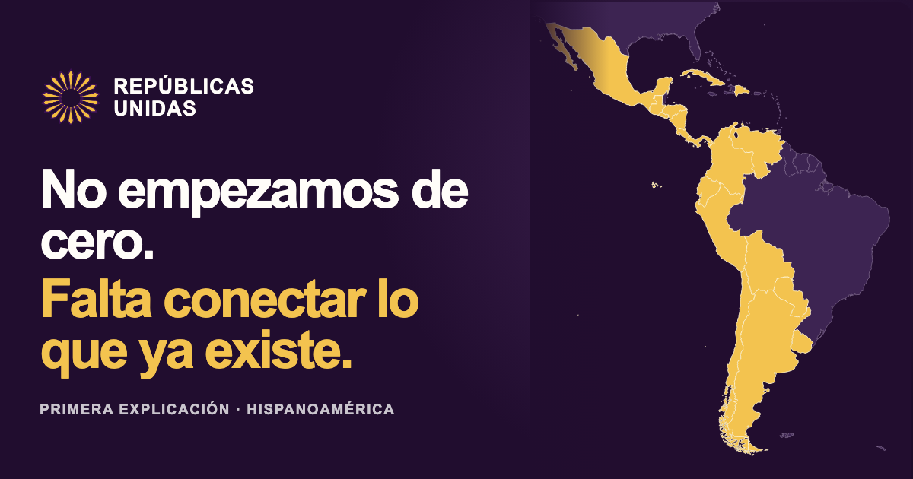

# Archivo visual de Repúblicas Unidas

Este directorio es la fuente pública de los recursos visuales de RRUU. Git conserva quién cambió cada archivo, cuándo cambió y qué versión existía en cada momento; este catálogo explica para qué sirve cada recurso sin obligar a recorrer el historial técnico.

Las reglas de uso, voz y composición se encuentran en la [guía fuente de identidad](../BRAND.md) y en la [página pública](https://republicasunidas.org/identidad/).

## Catálogo vigente

### Sol de las Repúblicas

- **Archivo:** [`sol-de-las-republicas.png`](./sol-de-las-republicas.png)
- **Estado:** identidad visual provisional vigente
- **Uso:** web, documentación y piezas institucionales
- **Significado:** dieciocho repúblicas, un espacio central abierto y ningún centro absoluto

### Mapa de Hispanoamérica

- **Archivo canónico:** [`maps/hispanoamerica.svg`](./maps/hispanoamerica.svg)
- **Metadatos y lista de países:** [`maps/hispanoamerica.json`](./maps/hispanoamerica.json)
- **Metodología:** [`maps/README.md`](./maps/README.md)
- **Estado:** mapa vectorial vigente; la ilustración WebP anterior queda retirada y no debe reutilizarse
- **Uso:** proyectos, integración regional, visualizaciones y comunicación pública
- **Fuente geográfica:** Natural Earth, Admin 0 Countries 1:50m, versión fijada y verificable

### Avatar para Instagram

- **Archivo:** [`social/instagram-profile-sol.png`](./social/instagram-profile-sol.png)
- **Ficha de procedencia:** [`social/instagram-profile-sol.md`](./social/instagram-profile-sol.md)
- **Estado:** exportación vigente
- **Uso:** foto de perfil en redes sociales

### Tarjeta social · publicación 1

- **Archivo:** [`social/post-01-og-v2.png`](./social/post-01-og-v2.png)
- **Ficha de procedencia:** [`social/post-01-og.md`](./social/post-01-og.md)
- **Estado:** vigente, revisión 0.2
- **Uso:** Open Graph y enlaces compartidos de la primera publicación editorial

## Cómo incorporar un recurso

1. Guardar el archivo final dentro de `assets/` o de una subcarpeta por canal, como `assets/social/`.
2. Añadirlo a este catálogo con propósito, estado y una vista previa.
3. Cuando sea generado o derivado, crear una ficha `.md` junto al archivo con su procedencia, referencias y prompt.
4. Vincular el commit con el issue o la decisión que originó el recurso cuando exista.
5. Para cambios sustanciales, crear una versión nueva (`-v2`, `-v3`) en vez de reemplazar silenciosamente la anterior.

## Criterios

- El repositorio es el archivo canónico y público; no hace falta una galería separada mientras el catálogo siga siendo manejable.
- Git conserva las versiones retiradas, por lo que no duplicamos archivos solamente para archivarlos.
- No se publican nombres personales, correos privados, credenciales ni rutas locales en las fichas.
- Los archivos de trabajo editables se conservan junto a la exportación cuando existan y cuando su licencia permita publicarlos.
- Las piezas deben indicar si son **provisionales**, **vigentes**, **experimentales** o **retiradas**.
