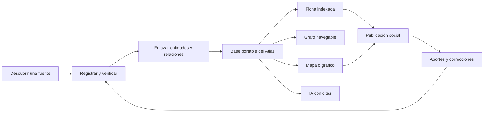

# Implementación del Atlas y sistema visual

## Decisión de producto

El Atlas no será solamente una base de datos ni una visualización. Será el sistema común que convierte conocimiento disperso sobre la integración hispanoamericana en conexiones comprensibles y reutilizables.

Una misma investigación debe poder alimentar:

- una ficha pública y buscable;
- un grafo de relaciones;
- un mapa o visualización;
- una publicación para redes;
- una respuesta futura de IA que cite sus fuentes.

La publicación social atrae atención; la página preserva el contexto; el Atlas acumula conocimiento; las fuentes permiten comprobarlo.

## Qué se captura

### Nodos principales

- **Organización:** organismo, institución, red, universidad, centro de investigación o colectivo.
- **Iniciativa:** tratado, programa, proyecto, plataforma, decisión, conjunto de datos o propuesta.
- **Persona:** responsable público, especialista o investigador con un papel documentado.

### Nodos de referencia

- **País o territorio:** ubicación, membresía o cobertura.
- **Fuente:** evidencia de una afirmación o relación.
- **Recurso:** sitio, base de datos, biblioteca, mapa, archivo o herramienta útil ya existente.
- **Indicador:** observación comparable con fecha, definición, unidad, método y fuente.
- **Publicación:** explicación de RRUU que utiliza y enlaza los registros anteriores.

### Relaciones iniciales

Usar un vocabulario pequeño y explícito: `integra`, `dirige`, `creó`, `ejecuta`, `financia`, `aplica_en`, `documenta`, `produce`, `continúa`, `reemplaza`, `coopera_con` y `explica`.

Cada relación necesita fuente, vigencia y fecha de última revisión. No se crea una conexión solo porque parezca probable.

## Arquitectura recomendada

Ningún servicio externo debe ser dueño único del archivo. Los datos canónicos se exportan periódicamente como CSV o JSON al repositorio, junto con el esquema, las fuentes y el historial de cambios.

| Función | Herramienta inicial | Por qué | Momento de reevaluar |
| --- | --- | --- | --- |
| Captura, revisión y formularios | [Baserow](https://baserow.io/) Cloud Free | Interfaz sencilla, formularios, API REST, proyecto de código abierto y exportación. El plan gratuito ofrece 3.000 filas por espacio. | Al acercarse a 2.000 filas, necesitar permisos avanzados o decidir autoalojamiento. |
| Grafo público experimental | [Kumu](https://kumu.io/) | Proyectos públicos, colaboradores, mapas y vistas ilimitados; importa hojas y permite incrustar el grafo. Puede comenzar gratis. | Después de 30 días: medir comprensión, mantenimiento, exportación y uso real. |
| Mapas, gráficos y piezas sociales | [Datawrapper](https://www.datawrapper.de/) Free | Publica e incrusta mapas interactivos y permite descargar PNG, suficiente para web y redes. | Pro cuesta US$21 por usuario al mes si se necesita retirar atribución o exportar SVG/PDF. |
| Archivo, esquema e historial | GitHub | Conserva versiones, decisiones, datos exportados, recursos visuales y propuestas públicas. | Mantener siempre, aunque cambien las demás herramientas. |
| Mapa propio del sitio | [MapLibre GL JS](https://maplibre.org/maplibre-gl-js/docs/) | Biblioteca abierta para capas interactivas, estilos propios y una experiencia integrada a RRUU. | Construir cuando existan al menos tres capas verificadas que justifiquen desarrollo propio. |

### Alternativas que se mantienen bajo observación

- [Graph Commons](https://graphcommons.com/plans) es una alternativa especialmente fuerte si necesitamos API GraphQL, análisis de redes y una base orientada a grafos desde el inicio. El plan gratuito admite hasta 100 nodos por grafo y Professional cuesta US$20 al mes para grafos de hasta 20.000 nodos. No se debe pagar antes de comparar un mismo conjunto piloto en Kumu y Graph Commons.
- [Flourish](https://flourish.studio/pricing/) puede servir para historias animadas o piezas narrativas especiales. Datawrapper es preferible para el arranque porque su plan gratuito permite descargar PNG.
- [Neo4j](https://neo4j.com/pricing/) ofrece una base de grafos operativa y escalable. Su versión gratuita sirve para aprender, pero añadir infraestructura antes de tener consultas y usuarios reales aumentaría el mantenimiento sin demostrar más valor.

Precios y capacidades revisados el 20 de agosto de 2026. Deben comprobarse nuevamente antes de contratar.

## Flujo de una investigación

1. **Descubrir:** guardar el enlace y anotar por qué puede ser útil.
2. **Capturar:** crear o actualizar organización, iniciativa, persona, recurso o indicador.
3. **Verificar:** registrar la afirmación exacta, la fuente, la fecha consultada y su nivel de confianza.
4. **Enlazar:** conectar solo relaciones explícitas que la evidencia permita sostener.
5. **Visualizar:** elegir mapa, grafo, cronología o tabla según la pregunta; no según la herramienta disponible.
6. **Explicar:** publicar una página clara que responda una pregunta concreta.
7. **Adaptar:** convertir el hallazgo principal en carrusel, historia, video o mapa social.
8. **Aprender:** registrar preguntas, correcciones y nuevos enlaces aportados por la comunidad.

## Sistema editorial cartográfico

Una pieza visual inicial debe poder entenderse en pocos segundos y ofrecer profundidad a quien la quiera:

- una pregunta o afirmación principal;
- un mapa dominante y legible en teléfono;
- un hallazgo, no una colección de datos sin conclusión;
- hasta tres datos de apoyo;
- año, alcance y fuente visibles;
- una advertencia cuando falten datos o no sean comparables;
- llamada a explorar la página completa o aportar una corrección;
- texto alternativo y versión tabular accesible.

El mapa no reemplaza la explicación. Su función es hacer visible una relación espacial; la página indexada conserva definiciones, metodología, fuentes, datos y actualizaciones.

### Series de mapas que pueden crecer con el Atlas

1. **Quién integra qué:** membresías superpuestas de organismos regionales.
2. **Qué derecho existe dónde:** residencia, movilidad, estudios, seguridad social o documentos.
3. **La integración que ya usas:** servicios y mecanismos cotidianos por país.
4. **Fronteras que conectan:** corredores, pasos, comercio e infraestructura compartida.
5. **Historia territorial de la integración:** congresos, federaciones, tratados e intentos que dejaron una lección.
6. **Arquitectura regional:** parlamentos, tribunales, bancos, secretarías y órganos técnicos.
7. **Opinión pública:** apoyo a distintas formas de cooperación, solo con preguntas y años comparables.
8. **Dónde están los datos:** portales públicos, observatorios y vacíos de información por país.
9. **Personas que conectan:** investigadores y responsables públicos, limitados a funciones documentadas.
10. **Una fecha, varios países:** cómo un acontecimiento regional afectó o movilizó distintas repúblicas.
11. **Cooperación fuera de Hispanoamérica:** Benelux, países nórdicos, Unión Africana y otras comparaciones útiles.
12. **Lo que todavía no conecta:** fricciones concretas y proyectos que podrían resolverlas.

## Catálogo de recursos existentes

RRUU no debe duplicar buenos portales. Debe hacerlos encontrables y explicar para qué sirven. Cada recurso registra:

- nombre, URL y organización responsable;
- tipo: sitio, base de datos, mapa, biblioteca, archivo, API o informe recurrente;
- temas, países y periodos cubiertos;
- acceso público, formato de descarga, licencia y frecuencia de actualización cuando se conozcan;
- entidades e iniciativas relacionadas;
- fecha de última comprobación;
- una frase práctica: “sirve para…”.

Una ficha de organización puede así enlazar sus iniciativas, responsables, documentos, datos y recursos externos sin aparentar que RRUU los produjo.

## Piloto de 30 días

### Semana 1 · Modelo y captura

- crear tablas de entidades, relaciones, fuentes y recursos en Baserow;
- publicar un formulario de sugerencias separado del proceso de verificación;
- importar diez organizaciones, quince iniciativas, diez recursos y veinte relaciones del primer artículo;
- hacer la primera exportación CSV/JSON al repositorio.

### Semana 2 · Grafo

- importar el mismo piloto a Kumu;
- crear vistas por tipo, país y tema;
- probar la incrustación en una página no enlazada del sitio;
- pedir a cinco personas que respondan tres preguntas usando el grafo.

### Semana 3 · Mapas y contenido

- crear en Datawrapper una plantilla de cobertura, una comparativa y una cronología geográfica;
- producir tres piezas con el formato mapa + hallazgo + fuente;
- publicar para cada una una página con datos, método y enlaces del Atlas.

### Semana 4 · Evaluación

- medir tiempo de captura, errores, comprensión, visitas a fuentes y aportes recibidos;
- comprobar que todos los datos puedan exportarse y reconstruirse;
- decidir entre mantener Kumu, probar Graph Commons Professional o construir una vista propia;
- priorizar las siguientes tres capas según utilidad, no solo atractivo visual.

## Criterios para gastar

El piloto comienza en **US$0 al mes**. Se autoriza un gasto cuando evita trabajo repetido o mejora un resultado medido:

- Kumu Pro: si marca, comentarios o control de colaboradores resuelven un problema real;
- Datawrapper Pro: si los mapas se publican con frecuencia y SVG, historial o ausencia de atribución tienen valor demostrable;
- Graph Commons Professional: si sus consultas, API o análisis ahorran más tiempo del que cuesta;
- infraestructura propia: solo cuando el contenido, las consultas o la participación superen las capacidades del piloto.

Todo gasto del Atlas se registra en el futuro libro público con proveedor, finalidad, periodo, responsable de aprobación y resultado esperado.

## Señales de que funciona

- porcentaje de fichas y relaciones con fuente verificable;
- tiempo para pasar de fuente descubierta a registro revisado;
- personas que abren una segunda ficha o una fuente;
- correcciones y recursos útiles aportados por terceros;
- mapas reutilizados en más de una publicación;
- preguntas que el Atlas permite responder y antes exigían buscar en varios sitios;
- decisiones editoriales o proyectos nacidos de vacíos visibles en el grafo.

No mediremos éxito por el número bruto de nodos. Un grafo pequeño, comprobable y útil vale más que una red grande de conexiones ambiguas.
