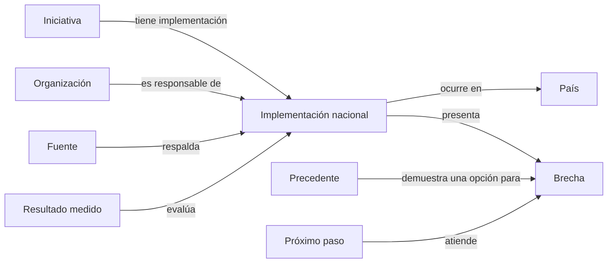

# Explorador de integración

## Propósito

El Explorador convierte información institucional dispersa en respuestas prácticas:

- qué iniciativas existen sobre un tema;
- qué organizaciones y personas públicas participan;
- qué países están cubiertos;
- cómo avanza la implementación en cada país;
- qué evidencia permite comprobarlo;
- dónde existe una brecha concreta y cuál podría ser el próximo paso.

Sirve a ciudadanía, periodistas, investigadores, organizaciones, legisladores y equipos públicos con tiempo limitado. Una persona debe poder pasar de una pregunta regional a una ficha verificable sin conocer de antemano el nombre del tratado o de la institución responsable.

## Recorridos principales

1. **Por iniciativa:** propósito, base jurídica, responsables, países, recursos, implementación, resultados y brechas.
2. **Por país:** iniciativas vigentes, autoridad responsable y estado de cada dimensión de implementación.
3. **Por tema:** movilidad, educación, comercio, salud, datos públicos, infraestructura u otro ámbito.
4. **Por organización o persona:** iniciativas relacionadas y función documentada.
5. **Por brecha:** países afectados, precedente existente, responsables posibles, dependencias y evidencia.

La implementación nacional es un nodo propio porque una sola relación `iniciativa aplica en país` no puede conservar regulación, responsables, acceso, resultados, brechas, fechas y múltiples fuentes de manera comprensible.

## Ficha de iniciativa

La primera versión mostrará:

- nombre oficial, alias e identificador estable;
- propósito explicado en una frase;
- tema y tipo de instrumento;
- base jurídica y fechas relevantes;
- organización coordinadora y responsables públicos documentados;
- países participantes y mapa de cobertura;
- tabla de implementación por país;
- recursos oficiales, datos y sitios útiles;
- indicadores y resultados publicados;
- brechas conocidas y preguntas de investigación;
- iniciativas relacionadas, precedentes y mecanismos sucesores;
- fuentes, última revisión e historial de correcciones.

## Implementación por país

Cada par `iniciativa + país` recibe un registro propio. La evaluación se divide en dimensiones para evitar una puntuación engañosa:

| Dimensión | Pregunta |
| --- | --- |
| Compromiso jurídico | ¿El país firmó, ratificó, incorporó o reglamentó lo necesario? |
| Operación | ¿Existen autoridad, procedimiento, presupuesto, sistema o servicio funcionando? |
| Acceso | ¿La población cubierta puede utilizarlo y se conocen requisitos, costos y tiempos? |
| Resultados | ¿Hay indicadores que muestren cobertura, calidad, cumplimiento o impacto? |
| Transparencia | ¿Se publican normas, responsables, datos, cambios y mecanismos de reclamo? |

Cada dimensión conserva un estado controlado, una explicación breve, fecha observada y evidencia. `Sin datos`, `no aplica`, `parcial`, `operativo` y `resultado verificado` son situaciones distintas.

Una cifra total puede parecer objetiva y ocultar diferencias importantes. El piloto utilizará perfiles por dimensión; solo ensayará índices agregados cuando exista metodología pública, comparable y revisada.

## De la brecha al próximo paso

El Explorador permitirá clasificar brechas sin convertir automáticamente una observación en recomendación:

- falta de adhesión o incorporación jurídica;
- falta de reglamentación;
- capacidad administrativa o presupuesto insuficiente;
- sistemas o datos que no interoperan;
- acceso difícil, costoso o poco conocido;
- cobertura geográfica o poblacional incompleta;
- ausencia de datos públicos;
- falta de evaluación de resultados;
- duplicación o contradicción entre mecanismos.

Una oportunidad de “fruto cercano” necesita:

- problema y población afectados claramente definidos;
- precedente verificable en otro país o mecanismo;
- autoridad o actor capaz de intervenir;
- dependencia jurídica, técnica y presupuestaria conocida;
- resultado medible;
- evidencia suficiente para distinguir oportunidad de intuición.

Así, el Atlas puede generar agendas de investigación y notas útiles para equipos legislativos o ejecutivos sin presentar preferencias políticas como hechos.

## Interfaz mínima

La primera versión puede ser una página del sitio con:

- búsqueda por nombre, alias o palabra clave;
- filtros por país, tema, tipo, vigencia y estado de implementación;
- listado de iniciativas con resumen y cobertura;
- ficha de iniciativa con tabla país por país;
- fuente accesible desde cada estado o afirmación;
- vistas de mapa y grafo como complementos;
- enlace permanente para cada ficha y cada combinación de filtros;
- botón para aportar fuente, corrección o experiencia de implementación.

El listado y las fichas son el núcleo. El grafo ayuda a explorar relaciones complejas y el mapa revela patrones geográficos, pero ninguno reemplaza una explicación legible.

## Personas necesarias

El proyecto puede incorporar colaboradores mediante tareas pequeñas y comprobables:

- **investigación institucional:** localizar normas, decisiones, informes y datos;
- **derecho y política pública:** interpretar vigencia, incorporación y competencias;
- **verificación por país:** comprobar procedimientos y experiencia de implementación;
- **datos:** mantener vocabularios, calidad, importaciones y exportaciones;
- **cartografía y visualización:** convertir datos en mapas accesibles;
- **producto y desarrollo:** búsqueda, filtros, fichas, API y experiencia móvil;
- **edición:** traducir lenguaje técnico sin perder precisión;
- **alianzas:** invitar a instituciones y especialistas a revisar sus fichas.

La contribución inicial recomendada es verificar un solo registro `iniciativa + país`, aportar una fuente o comprobar un recurso. Esto permite demostrar criterio antes de asumir una responsabilidad amplia.

## Primer piloto

Empezar con tres iniciativas de naturaleza distinta:

1. Estatuto Migratorio Andino;
2. Acuerdo sobre Residencia del MERCOSUR;
3. proceso de Integración Profunda entre Guatemala, Honduras y El Salvador.

El piloto debe cubrir todos sus países relevantes, producir una ficha por iniciativa y probar si las cinco dimensiones permiten explicar diferencias reales. Después se decide qué campos conservar, dividir o eliminar.

## Criterios de éxito

- una persona encuentra una iniciativa sin conocer su organismo;
- puede comparar dos países sin abrir múltiples portales;
- cada estado lleva a evidencia y fecha;
- “sin datos” nunca se muestra como incumplimiento;
- una brecha genera una pregunta investigable o un próximo paso con responsable posible;
- un colaborador nuevo puede verificar un registro con instrucciones públicas;
- los datos se exportan y reconstruyen fuera de la herramienta de captura.
